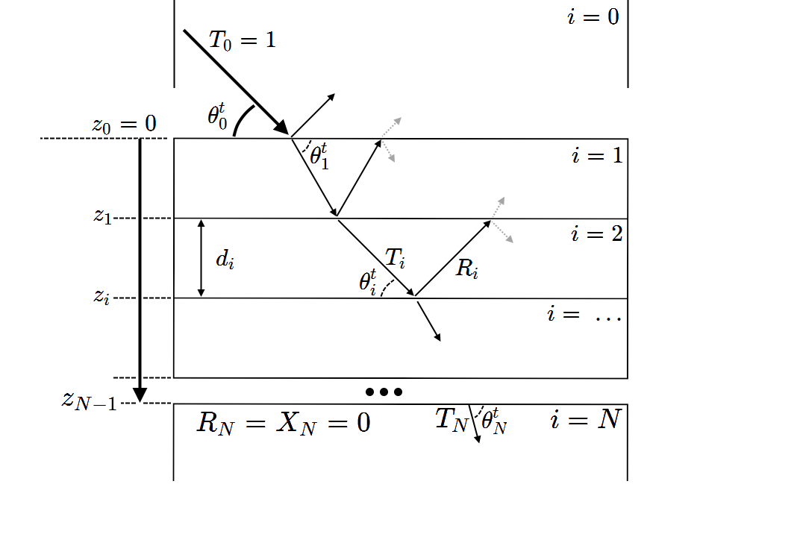

# XEFI
A package for calculations of X-ray Electric Field Intensities (XEFI) using the Parratt recursive algorithm.

This package calculates discrete models of multi-layer structures, including the ability to slice simplistic models into arbitrary layers.
Supports the use of the `KKCalc` package to calculate the index of refraction within layers.


### The Model
To make this model representative of the code, we count $N+1$ layers from $i=0$ to $i=N$ inclusive, as `python` indexes.


Here, layers $i=0$ and $i=N$ are semi-infinite layers, typically modelling air/vacuum and a substrate respectively. Boundary conditions allow us to set the incident amplitude $T_0 = 1$, and the reflected amplitude $R_{N}=0$. We define the following quantities:
| Variable     | Description
| -            | -
| $N$          | The number of interfaces between the top and bottom layers, corresponding to $N+1$ layers
| $i$          | The layer number, indexed from 0 (i.e. 0 to $N$)
| $z_i$        | The depth of the $i^{th}$ interface ($z_i < 0$).
| $d_i$        | The thickness of the $i^{th}$ layer ($d_0 = d_N = \infty$)
| $\theta^t_i$ | The transmitted angle of incidence in layer $i$. Same as the angle of reflection $\theta^r_i$ in layer $i$.
| $k_i$        | The z-component of the wavevector in the $i^{th}$ layer.
| $T_i$        | The complex amplitude of the downward propogating electric field at interface $i$.
| $R_i$        | The complex amplitude of the upward propogating electric field at interface $i$.
| $X_i$        | The ratio of the downward and upward propogating electric field intensities at interface $i$.
| $E^{Total}_i$| The total electric field in layer $i$.
| $E_{beam}$   | The X-ray beam energy in eV.

After recursively computing the ratio $X_i$, then solving the amplitudes $T_i$, $R_i$ at each interface, then the total electric field at depth $z$ in the film can then be calculated as the sum of downward and upward propogating waves:\
```math
E^{Total}_i(E_{beam}, \theta^t_0, z) = T_i(E_{beam}, \theta^t_0) \exp\left(-i k_i \left(z-z_i\right)\right) + R_i  (E_{beam}, \theta^t_0) \exp\left(i k_i \left(z-z_i\right)\right)
```
