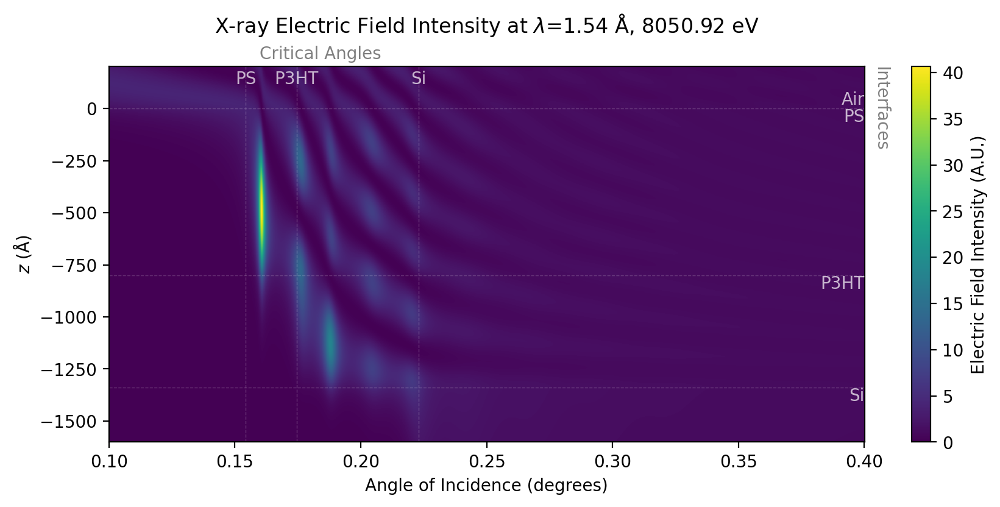

XEFI
====

A package for calculations of X-ray Electric Field Intensities (XEFI) using the Parratt recursive algorithm, and built to the feature-rich standards of `xraysoftmat <https://github.com/xraysoftmat>`_.

This package calculates discrete models of multi-layer structures, including the ability to slice simplistic models into arbitrary layers.
Supports the use of the `KKCalc` package to calculate the index of refraction within layers.

|tool-semver| |tool-black| |tool-ruff| |tool-numpydoc|

|PyPI Version| |PyTest| |Coveralls| |Pre-commit|

.. |PyPI Version| image:: https://img.shields.io/pypi/v/XEFI?label=XEFI&logo=pypi
   :target: https://pypi.org/project/XEFI/
   :alt: pypi
.. |PyTest| image:: https://github.com/xraysoftmat/XEFI/actions/workflows/test.yml/badge.svg
    :alt: PyTest
    :target: https://github.com/xraysoftmat/XEFI/actions/workflows/test.yml
.. |Coveralls| image:: https://coveralls.io/repos/github/xraysoftmat/XEFI/badge.svg
    :alt: Coverage Status
    :target: https://coveralls.io/github/xraysoftmat/XEFI
.. |Pre-commit| image:: https://results.pre-commit.ci/badge/github/xraysoftmat/XEFI/main.svg
    :alt: pre-commit.ci status
    :target: https://results.pre-commit.ci/latest/github/xraysoftmat/XEFI/main

.. |tool-semver| image:: https://img.shields.io/badge/versioning-Python%20SemVer-blue.svg
    :alt: Python SemVer
    :target: https://python-semantic-release.readthedocs.io/en/stable/
.. |tool-black| image:: https://img.shields.io/badge/code%20style-black-000000.svg
    :alt: Code style: black
    :target: https://github.com/psf/black
.. |tool-ruff| image:: https://img.shields.io/endpoint?url=https://raw.githubusercontent.com/astral-sh/ruff/main/assets/badge/v2.json
    :alt: Ruff
    :target: https://github.com/astral-sh/ruff
.. |tool-numpydoc| image:: https://img.shields.io/badge/doc_style-numpydoc-blue.svg
    :alt: Code doc: numpydoc
    :target: https://github.com/numpy/numpydoc

The Model
#########
To make this model representative of the code, we count $N+1$ layers from $i=0$ to $i=N$ inclusive, as `python` indexes.

.. image:: ./docs/source/_static/graphics/geometry.png
   :alt: Screenshot of the XEFI model geometry.
   :scale: 50%
   :align: center

Here, layers $i=0$ and $i=N$ are semi-infinite layers, typically modelling air/vacuum and a substrate respectively. Boundary conditions allow us to set the incident amplitude $T_0 = 1$, and the reflected amplitude $R_{N}=0$. We define the following quantities:

+---------------+-------------------------------------------------------------------------------------------------------------+
| **Variable**  | **Description**                                                                                             |
+===============+=============================================================================================================+
| $N$           | The number of interfaces between the top and bottom layers, corresponding to $N+1$ layers                   |
+---------------+-------------------------------------------------------------------------------------------------------------+
| $i$           | The layer number, indexed from 0 (i.e. 0 to $N$)                                                            |
+---------------+-------------------------------------------------------------------------------------------------------------+
| $z_i$         | The depth of the $i^{th}$ interface ($z_i < 0$).                                                            |
+---------------+-------------------------------------------------------------------------------------------------------------+
| $d_i$         | The thickness of the $i^{th}$ layer ($d_0 = d_N = ∞$)                                                       |
+---------------+-------------------------------------------------------------------------------------------------------------+
| $θ^t_i$       | The transmitted angle of incidence in layer $i$. Same as the angle of reflection $θ^r_i$ in layer $i$.      |
+---------------+-------------------------------------------------------------------------------------------------------------+
| $k_i$         | The z-component of the wavevector in the $i^{th}$ layer.                                                    |
+---------------+-------------------------------------------------------------------------------------------------------------+
| $T_i$         | The complex amplitude of the downward propogating electric field at interface $i$.                          |
+---------------+-------------------------------------------------------------------------------------------------------------+
| $R_i$         | The complex amplitude of the upward propogating electric field at interface $i$.                            |
+---------------+-------------------------------------------------------------------------------------------------------------+
| $X_i$         | The ratio of the downward and upward propogating electric field intensities at interface $i$.               |
+---------------+-------------------------------------------------------------------------------------------------------------+
| $E^{Total}_i$ | The total electric field in layer $i$.                                                                      |
+---------------+-------------------------------------------------------------------------------------------------------------+
| $E_{beam}$    | The X-ray beam energy in eV.                                                                                |
+---------------+-------------------------------------------------------------------------------------------------------------+

After recursively computing the ratio $X_i$, then solving the amplitudes $T_i$, $R_i$ at each interface, then the total electric field at depth $z$ in the film can then be calculated as the sum of downward and upward propogating waves:

$$E^{Total}_i(E_{beam}, θ^t_0, z) = T_i(E_{beam}, θ^t    _0) exp(-i k_i (z-z_i))   + R_i  (E_{beam}, θ^t_0) exp(i k_i (z-z_i))$$