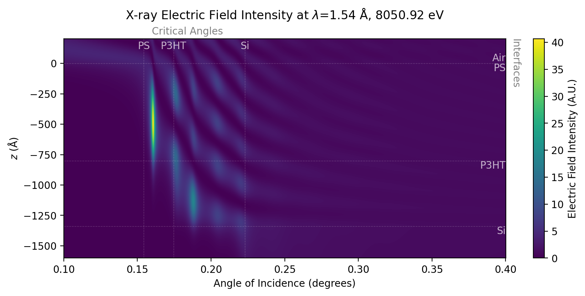

:html_theme.sidebar_secondary.remove: true

XEFI
====

A package for calculations of X-ray Electric Field Intensities (XEFI) using the Parratt recursive algorithm, and built to the feature-rich standards of `xraysoftmat <https://github.com/xraysoftmat>`_.

This package calculates discrete models of multi-layer structures, including the ability to slice simplistic models into arbitrary layers.
Supports the use of the `KKCalc` package to calculate the index of refraction within layers.

.. MAKE SURE TO UPDATE THE README.rst to match. These files are now diverged.

|PyPI Version| |readthedocs| |Coveralls| |Pre-commit|

|PyTest| |Linting| |Documentation|

|tool-semver| |tool-black| |tool-ruff| |tool-numpydoc|

.. |PyPI Version| image:: https://img.shields.io/pypi/v/XEFI?label=XEFI&logo=pypi
   :target: https://pypi.org/project/XEFI/
   :alt: pypi
.. |PyTest| image:: https://github.com/xraysoftmat/XEFI/actions/workflows/tests.yml/badge.svg
    :alt: PyTest
    :target: https://github.com/xraysoftmat/XEFI/actions/workflows/tests.yml
.. |Linting| image:: https://github.com/xraysoftmat/XEFI/actions/workflows/linting.yml/badge.svg
    :alt: Linting
    :target: https://github.com/xraysoftmat/XEFI/actions/workflows/linting.yml
.. |Documentation| image:: https://github.com/xraysoftmat/XEFI/actions/workflows/docs.yml/badge.svg
    :alt: Documentation
    :target: https://github.com/xraysoftmat/XEFI/actions/workflows/docs.yml
.. |Coveralls| image:: https://coveralls.io/repos/github/xraysoftmat/XEFI/badge.svg
    :alt: Coverage Status
    :target: https://coveralls.io/github/xraysoftmat/XEFI
.. |Pre-commit| image:: https://results.pre-commit.ci/badge/github/xraysoftmat/XEFI/main.svg
    :alt: pre-commit.ci status
    :target: https://results.pre-commit.ci/latest/github/xraysoftmat/XEFI/main
.. |readthedocs| image:: https://img.shields.io/readthedocs/XEFI?version=latest&style=flat&label=ReadtheDocs
    :alt: Documentation
    :target: https://XEFI.readthedocs.io/

.. |tool-semver| image:: https://img.shields.io/badge/versioning-Python%20SemVer-blue.svg
    :alt: Python SemVer
    :target: https://python-semantic-release.readthedocs.io/en/stable/
.. |tool-black| image:: https://img.shields.io/badge/code%20style-black-000000.svg
    :alt: Code style: black
    :target: https://github.com/psf/black
.. |tool-ruff| image:: https://img.shields.io/endpoint?url=https://raw.githubusercontent.com/astral-sh/ruff/main/assets/badge/v2.json
    :alt: Ruff
    :target: https://github.com/astral-sh/ruff
.. |tool-numpydoc| image:: https://img.shields.io/badge/doc_style-numpydoc-blue.svg
    :alt: Code doc: numpydoc
    :target: https://github.com/numpy/numpydoc

Links
#####

Please raise any `issues <https://github.com/xraysoftmat/XEFI/issues>`_ here.

- Development (Github): https://github.com/xraysoftmat/XEFI/
- Releases
   * Github Releases: https://github.com/xraysoftmat/XEFI/releases
   * PyPI: https://pypi.python.org/pypi/XEFI/
- Documentation (ReadtheDocs): https://XEFI.readthedocs.io/

.. toctree::
    :hidden:

    source/install
    source/tutorials/index
    source/contributing
    CHANGELOG
    source/api

.. hello?
