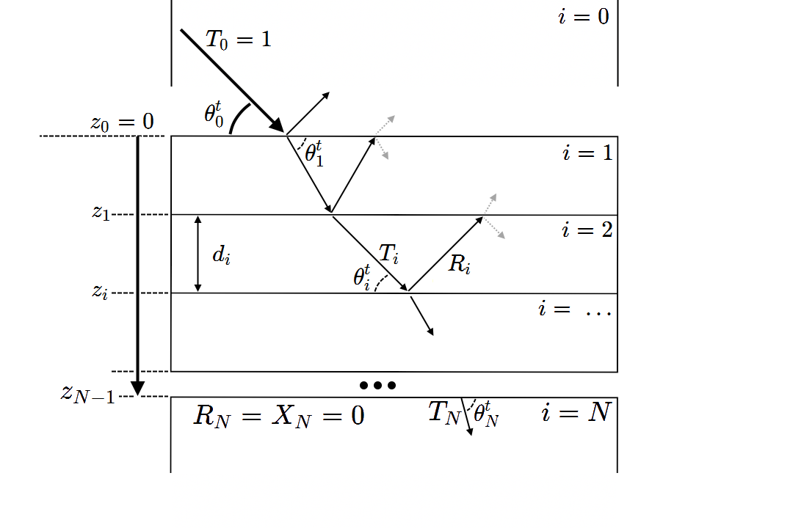

===========
XEFI Theory
===========

The Algorithm
#############
To calculate the X-ray Electric Field Intensity (XEFI) at a given depth :math:`z` within a multi-layer structure, we use a recursive algorithm. Historically, there's two equivalent formulations that appeared at similar times; the Parratt algorithm [1]_, and the Abeles matrix method [2]_.
For more detail, we refer the reader to more modern references used to construct the recursive algorithm include Tolan [3]_ and Dev [4]_.

The algorithm models the multi-layer structure as a series of discrete layers, each with its own thickness and index of refraction. To make this model representative of the code, we count :math:`N+1` layers from :math:`i=0` to :math:`i=N` inclusive, as `python` indexes.

Here, layers :math:`i=0` and :math:`i=N` are semi-infinite layers, typically modelling air/vacuum and a substrate respectively. Boundary conditions allow us to set the incident amplitude :math:`T_0 = 1`, and the reflected amplitude :math:`R_{N}=0`.

The algorithm uses the Fresnel equations to calculate the reflected and transmitted amplitudes at each interface, and then recursively calculates the ratio of downward to upward propogating electric field intensities at each interface, starting from the bottom layer and working upwards. This recursive calculation is the core of the algorithm, solved by equating the tangential components (in-plane) of the electric field vectors

For the ``XEFI`` package, We define the following quantities:

+---------------------+-----------------------------------------------------------------------------------------------------+
| **Variable**        | **Description**                                                                                     |
+=====================+=====================================================================================================+
| :math:`N`           | The number of interfaces between the top and bottom layers, corresponding to :math:`N+1` layers     |
+---------------------+-----------------------------------------------------------------------------------------------------+
| :math:`i`           | The layer number, indexed from 0 (i.e. 0 to :math:`N`)                                              |
+---------------------+-----------------------------------------------------------------------------------------------------+
| :math:`z_i`         | The depth of the :math:`i^{th}` interface (:math:`z_i < 0`).                                        |
+---------------------+-----------------------------------------------------------------------------------------------------+
| :math:`d_i`         | The thickness of the :math:`i^{th}` layer (:math:`d_0 = d_N = ∞`)                                   |
+---------------------+-----------------------------------------------------------------------------------------------------+
|| :math:`θ^t_i`      || The transmitted angle of incidence in layer :math:`i`.                                             |
||                    || Same as the angle of reflection :math:`θ^r_i` in layer :math:`i`.                                  |
+---------------------+-----------------------------------------------------------------------------------------------------+
| :math:`k_i`         | The z-component of the wavevector in the :math:`i^{th}` layer.                                      |
+---------------------+-----------------------------------------------------------------------------------------------------+
| :math:`T_i`         | The complex amplitude of the downward propogating electric field at interface :math:`i`.            |
+---------------------+-----------------------------------------------------------------------------------------------------+
| :math:`R_i`         | The complex amplitude of the upward propogating electric field at interface :math:`i`.              |
+---------------------+-----------------------------------------------------------------------------------------------------+
| :math:`X_i`         | The ratio of the downward and upward propogating electric field intensities at interface :math:`i`. |
+---------------------+-----------------------------------------------------------------------------------------------------+
| :math:`E^{Total}_i` | The total electric field in layer :math:`i`.                                                        |
+---------------------+-----------------------------------------------------------------------------------------------------+
| :math:`E_{beam}`    | The X-ray beam energies in eV.                                                                      |
+---------------------+-----------------------------------------------------------------------------------------------------+

After recursively computing the ratio :math:`X_i`, then solving the amplitudes :math:`T_i`, :math:`R_i` at each interface, then the total electric field at depth :math:`z` in the film can then be calculated as the sum of downward and upward propogating waves:

.. math::

    E^{Total}_i(E_{beam}, θ^t_0, z) = \left.\begin{matrix}T_i(E_{beam}, θ^t_0) \exp(-i k_i (z-z_i)) \\+ R_i  (E_{beam}, θ^t_0) \exp(i k_i (z-z_i))\end{matrix}\right.

.. rubric:: References
.. [1] `Parratt, L. G. (1954). Surface studies of solids by total reflection of X-rays. Physical Review, 95(2), 359. <https://doi.org/10.1103/PhysRev.95.359>`_
.. [2] `Abeles, F. (1950). Recherches sur les couches minces. Annales de physique, 12(5), 596-640. <https://doi.org/10.1051/anphys/195012050596>`_
.. [3] `Tolan, M. (1999). X-ray scattering from soft-matter thin films: materials science and basic research. Springer Science & Business Media. <https://doi.org/10.1007/BFb0112834>`_
.. [4] `Dev, B., Dey, S., & Banerjee, S. (2000). Resonance enhancement of x rays in layered materials: Application to surface enrichment in polymer blends. Physical Review B, 61(13), 8462. <https://doi.org/10.1103/PhysRevB.61.8462>`_
